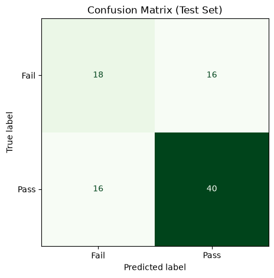

# Project Documentation

This site provides project documentation.
Use the documentation navigation to explore.

## How-To Guide

Many instructions are common to all our projects.

See
[⭐ **Workflow: Apply Example**](https://denisecase.github.io/pro-analytics-02/workflow-b-apply-example-project/)
to get the example projects running on your machine.

## Project Documentation Pages (docs/)

- **Home** - this documentation landing page
- [**Project Instructions**](./project-instructions.md)  - the standard project workflow
- [**Your Files**](./your-files.md) - how to copy the example and create your version
- [**Glossary**](./glossary.md) - project terms and concepts
- [**API**](./api.md) - autogenerated code documentation for the public project interface

## Phase 4. Technical Modification

I applied the same modification pattern in two places: the runnable example script and the example notebook.

**Script (`src/mlstudio/app_abdel.py`, copied from `app_case.py`):**

- **What I changed:** Added a new engineered feature, `engagement_score` (hours_studied × attendance_pct / 100), combining two raw signals into one composite measure of consistent study effort. I also changed the output by adding a new "Actual vs Predicted" residual chart and by saving a CSV report of test set predictions and residuals to `data/processed/model_predictions.csv`.
- **Why I chose this change:** Raw hours studied alone doesn't capture whether that time was reinforced by consistent classroom attendance. Combining the two into one feature is a realistic feature-engineering move, and saving predictions to a CSV is a standard professional step so results are auditable, not just printed to a chart window.
- **How I verified it worked:** I ran `uv run python -m mlstudio.app_abdel` and confirmed the model still trained successfully (mean absolute error 0.48, R-squared 1.00), the new feature appeared correctly in the logged data and in the model coefficients chart, the new residual chart displayed, and the new CSV file was created in `data/processed/`.
- **Result that confirmed the change:** The `project.log` output showed `engagement_score` values calculated correctly (e.g., 5.98 for the example prediction case), and `data/processed/model_predictions.csv` was created with actual scores, predicted scores, and residuals for each test case.

**Notebook (`notebooks/ml-03-abdel.ipynb`, copied from `ml_03_case.ipynb`):**

- **What I changed:** Added a derived feature, `bill_ratio` (bill_length_mm / bill_depth_mm), to the penguins classification example. I also changed the output by adding a normalized confusion matrix (percentages instead of raw counts) alongside the original count-based one, and by saving the full classification report to `data/processed/penguins_classification_report_abdel.csv`.
- **Why I chose this change:** A ratio of two raw measurements can carry more separable signal than either measurement alone, and a normalized confusion matrix makes it easier to compare classes of different sizes.
- **How I verified it worked:** I ran all cells top to bottom and confirmed the model trained successfully on the expanded feature set, both confusion matrices displayed correctly, and the classification report CSV was created.
- **Challenges:** I initially hit a `FileNotFoundError` and later an `OSError` when reading from `data/raw/` and saving to `data/processed/`, since a notebook's working directory is the `notebooks/` folder itself, not the project root. I resolved this by updating the relative paths to `../data/raw/...` and `../data/processed/...`.

**Compared with the example project:** both files behave identically to the originals for every existing feature and output, with the new feature and new outputs added cleanly on top. I'd rate this modification as moderate — not difficult conceptually, but it required tracing through several functions/cells to keep the new feature consistent everywhere it was used (training, prediction, and charting), and troubleshooting the notebook working-directory path issue took a bit of extra work.

## Phase 5. Custom Project

### Basis and Data

For my custom project, I moved away from the example's regression and species-classification problems and applied the same classification workflow to a manufacturing quality problem: predicting whether a production batch will pass or fail final spec compliance testing, based on in-process measurements.

- **Dataset:** `data/raw/batch_quality_abdel.csv` — 300 simulated production batches from a food/flavor manufacturing process.
- **Data source:** I generated this dataset myself to model a realistic batch release scenario, since I wanted a problem connected to my own professional background in manufacturing engineering rather than reusing the provided diabetes dataset.
- **Why I built it this way:** The relationships are constructed deliberately (batches drifting further from ideal mixing time, temperature, pH, and viscosity are more likely to fail; more experienced operators reduce failure risk) with realistic noise added, so the classifier has genuine, non-trivial work to do.
- **Limitations/assumptions:** Since this is simulated data, it doesn't capture every real-world complexity (e.g., equipment-specific failure modes, seasonal effects), but it mirrors the general shape of a real batch release / spec compliance decision.

### Modeling Approach

- This is a **supervised classification** problem: I have a labeled target (`batch_pass`), and that target is a discrete category (pass/fail), not a continuous number.
- I used a **DecisionTreeClassifier**, matching the modeling approach used in the module's own classification example, since decision trees are easy to interpret and explain to non-technical stakeholders — a valuable property in a manufacturing quality context where results often need to be explained to operators or managers.

### Target

- **Example target:** `species` (three-class penguin classification) in the module's example notebook.
- **My target:** `batch_pass` (binary: 1 = passed final spec compliance, 0 = failed).
- Switching from a three-class to a binary target simplifies the confusion matrix and classification report to two classes, and changes the practical question from "which of several categories" to "does this pass or not," which maps directly onto the specificity/precision vs. sensitivity/recall tradeoff we explored in the earlier discussion assignment.

### Features

- **Example features:** bill length, bill depth, flipper length, body mass (physical measurements of penguins).
- **My features:** `mixing_time_min`, `process_temp_c`, `ph_level`, `viscosity_cp`, `raw_material_age_days`, `operator_experience_yrs`, `humidity_pct`, `line_speed_units_min` — in-process manufacturing measurements collected during production, before final release testing.
- I kept the same overall structure (a fixed feature list feeding a single classifier) but replaced the features entirely with ones relevant to a manufacturing batch release decision.

### Evaluation and Results

- **Metric/evidence used:** test accuracy, a confusion matrix, and a full classification report (precision, recall, F1) on a stratified 70/30 train/test split.
- **Main result:** [fill in your actual test accuracy and any notable precision/recall numbers once you run it]
- **Usefulness:** [describe whether the result seemed useful/reasonable given the simulated relationships]
- **Weakness/next step:** Since the dataset is simulated, a natural next step would be validating this approach against real batch release records if they were available, and comparing the decision tree against a logistic regression or k-NN model.

### Summary

I built a custom classification project (`app_batch_abdel.py` and `notebooks/batch_quality_abdel.ipynb`) applying the module's classification workflow to a manufacturing batch release scenario. I trained a DecisionTreeClassifier to predict pass/fail outcomes from in-process measurements, evaluated it with a confusion matrix and classification report, and saved a predictions report for later review. This exercise reinforced how the same workflow (load, inspect, clean, split, fit, evaluate, summarize) applies across very different problems and target types, and it's directly relevant to real batch release / quality decisions in a manufacturing setting.

